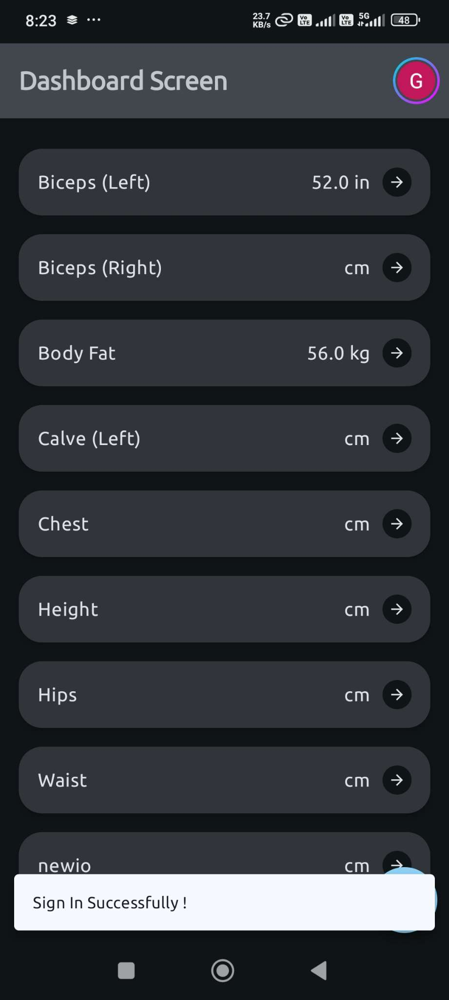
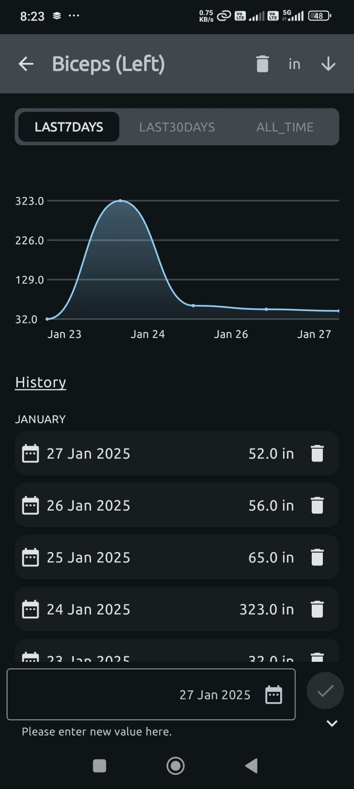
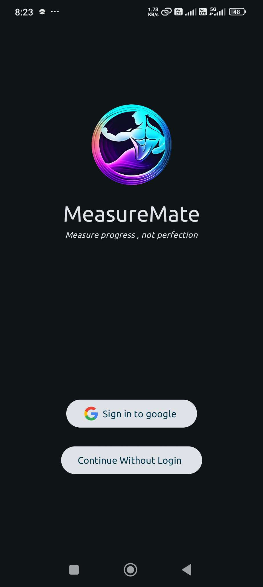

# MeasureMate

**MeasureMate** is a mobile application that helps users track body measurements over time. The app allows users to enter and view measurements for various body parts, see past values, and view a graph to track progress. Firebase Authentication and Google Sign-In are integrated for secure sign-ins and real-time data storage is handled by Firebase Firestore.

---

## 📷 **Screenshots**
Showcase your app with screenshots or a GIF of its functionality here:

<div style="display: flex; justify-content: space-between;">
  
  
  
</div>


## Features

- **Track Body Measurements**: Add measurements for different body parts (e.g., waist, chest, arms, etc.).
- **View Past Measurements**: View a list of stored body parts and their measurements.
- **Track Progress**: View a graph representing the measurement history of a specific body part.
- **Google Sign-In**: Users can securely log in using their Google account.
- **Real-Time Sync**: Store and sync measurements in Firebase Firestore, with real-time updates across devices.

## Tech Stack

- **Jetpack Compose**: UI toolkit for building native UIs.
- **Navigation**: Handles app navigation and navigation graphs.
- **Hilt**: Dependency injection library for managing dependencies.
- **Coil**: For image loading.
- **Material3**: UI components and design guidelines.
- **MVI Pattern**: Used for state management (Model-View-Intent).
- **Firebase**:
  - **Firebase Authentication**: Google Sign-In integration for authentication.
  - **Firebase Firestore**: Real-time database for storing and syncing data.
- **Google Credential Manager**: Integration with Google Sign-In for authentication.
- **Splash Screen API**: Added for a smooth startup screen experience.
- **Adaptive Layout**: Supports both portrait and landscape orientations.
- **Light and Dark Theme**: Theme support for light and dark modes.

## Features

- **Track Body Measurements**: Add measurements for different body parts (e.g., waist, chest, arms, etc.).
- **View Past Measurements**: View a list of stored body parts and their measurements.
- **Track Progress**: View a graph representing the measurement history of a specific body part.
- **Google Sign-In**: Users can securely log in using their Google account.
- **Real-Time Sync**: Store and sync measurements in Firebase Firestore, with real-time updates across devices.
- **Adaptive Layout**: Supports both portrait and landscape orientations seamlessly.
- **Theme Support**: Light and Dark mode themes for a more personalized user experience.

## 🎥 **Video Demonstration**


https://github.com/user-attachments/assets/fca2683f-4c07-4be6-a324-9d92ff5b4728


## Installation

### Step 1: Set Up Google Cloud Project

Before integrating Google Sign-In with Firebase, you need to create a project in **Google Cloud Platform** (GCP):

1. **Create a Project in Google Cloud**:
   - Go to the [Google Cloud Console](https://console.cloud.google.com/).
   - Create a new project and enable the **Google Identity Platform API**.

2. **Create OAuth 2.0 Credentials**:
   - Navigate to **APIs & Services > Credentials**.
   - Click **Create Credentials > OAuth 2.0 Client ID**.
   - Choose **Android** as the application type.
   - Enter the **package name** and **SHA-1 fingerprint** (from Android Studio).
   - Download the `google-services.json` file.

---

### Step 2: Set Up Firebase Project

Now, integrate Firebase with your Android app:

1. **Create a Firebase Project**:
   - Go to [Firebase Console](https://console.firebase.google.com/).
   - Create a new project and link it with the Google Cloud project you created earlier.

2. **Enable Google Sign-In**:
   - In Firebase Console, go to **Authentication > Sign-in method** and enable **Google** as a sign-in provider.

3. **Add Firebase SDK to Your Project**:
   - Download the `google-services.json` file from Firebase and add it to your Android app's `app/` directory.

4. **Add Dependencies**:
   In your app-level `build.gradle` file, add the following dependencies:

   ```gradle
   dependencies {
       implementation 'com.google.firebase:firebase-auth:21.0.1'
       implementation 'com.google.android.gms:play-services-auth:20.0.1'
       implementation 'androidx.credentials:credentials:1.1.1'
       implementation 'androidx.credentials:credentials-play-services-auth:1.1.1'
       implementation 'com.google.android.libraries.identity.googleid:googleid:1.1.1'
   }
